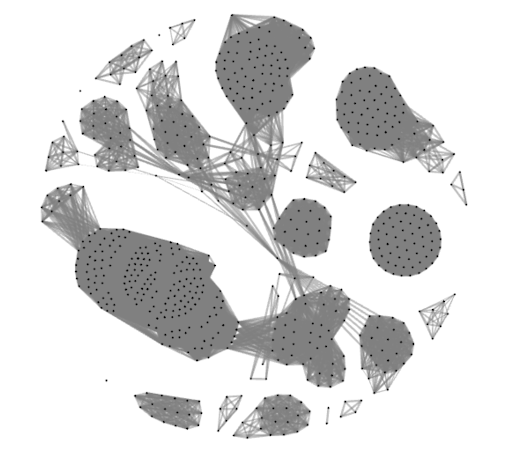

# Twitter Accord Network

## Introduction
This project aims to more deeply understand people who post on social media, particularly on Twitter. This project will pull twitter posts from the Twitter API, vectorize them using word2vec and then use LDA to detect common topics between the posts. Posts will then be placed into a network, and posts that have topics in common will be connected by an edge.

 The posts in this network can be classified in communities. Then, these communities can be analyzed to identify common opinions and thoughts within them. 

These communities have the potential to provide insight into vulnerabilities to misinformation that the people who made these posts may have. Using this insight, social media moderators can better protect people from exposure to misinformation that would be likely to reach them. This could also be used to inform health organizations of ways that they might be better able to reach out to communities that they have failed to resonate with thus far. For example, a community that does not like COVID vaccines but really likes a particular celebrity might be persuaded if that celebrity were to do an advertisement for COVID vaccines. 

## Setup
This project requires Conda in order to install the environments, as well as Make in order to automatically run commands.

To fully set up the environment, call `make init` and `make init-sentiment` in order to install the two environments necessary to run the code. For network analysis, Gephi is used to classify the posts into communities. After these prerequisites are met, you will be fully prepared to run the project.

Included are several other environment-related commands such as `update`, `export`, `update-sentiment`, and `export-sentiment`. In order to realign the environment with the .yml environment files, call `make update` or `make update-sentiment`. In order to export the current environments into .yml environment files, call `make export` or `make export-sentiment`.

## Running the Project
Included are 7 different commands to run scripts within the project. These include `pull`, `clean`, `train_word2vec`, `train_lda`, `analyze_sentiment`, `graph`, and `analyze_modularity_groups`. All commands but `analyze_sentiment` require the TwitterAccordNetwork Conda environment to be active, while `analyze_sentiment` requires the SentimentAnalysis Conda environment to be active.

These commands can be run in sequence in order to complete a full pipeline from Twitter dataset hydration to modularity group analysis. However, Gephi must be used to export the modularity groups and centrality measures into a .csv file before `analyze_modularity_groups` is run.

## Command Overview
* `pull` hydrates a Tweet dataset based on the Twitter post IDs provided in a .tsv file
* `clean` saves a preprocessed version of the data that removes capitalization, punctuation, stopwords, links, and several non-alphanumeric characters
    * Note emojis were difficult to fully filter out, and some will remain even in cleaned Tweets
* `train_word2vec` trains and saves a Word2Vec model over the Twitter dataset
* `train_lda` trains and saves an LDA model over the Twitter dataset
* `analyze_sentiment` saves the sentiment scores extracted from each Tweet
* `graph` constructs the agreement and disagreement graph in a .gexf format, which can then be analyzed using Gephi or whatever other graphing software
* `analyze_modularity_groups` takes a .csv file containing centrality measures and modularity groups for each Tweet in the graph in order to output a summary of each modularity group

## Analysis Overview
This project takes the textual content of Twitter posts and constructs a graph based on the accord displayed between each Tweet.

Accord is calculated using the similarities between the topic and sentiment scores of each Tweet and that of all others. These are calculated as follows:
* Topics are extracted from Tweets using an LDA model
* Topic similarities are calculated based on the weighted similarities between the top N keywords from each topic
* Keyword similarities are measured using a Word2Vec model
* Sentiment scores are extracted using a pre-trained transformer architecture
* Graph weights for the agreement graph are constructed between Tweets with similar topics and similar sentiments

Although we also construct a graph based on disagreement, only the graph based on agreement is used for further analysis using modularity groups.

Several centrality measures are calculated for all Tweets in their respective modularity groups, and the Tweets with the highest centrality measures in each group are outputted as a summary, along with the most common topic and its keywords.

## Future Work
This network still has much untapped potential. One idea that has not been explored yet is looking into how many posts by an individual appear within a community. If every post a user has ever made falls into one community, this information could be used to better understand the topic that is very important to this user. Or potentially if a community does not contain many posts from the same user, that is a sign that the topic in that community is very important to many people.

